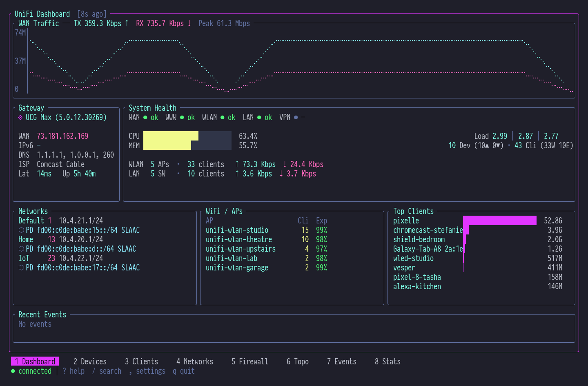
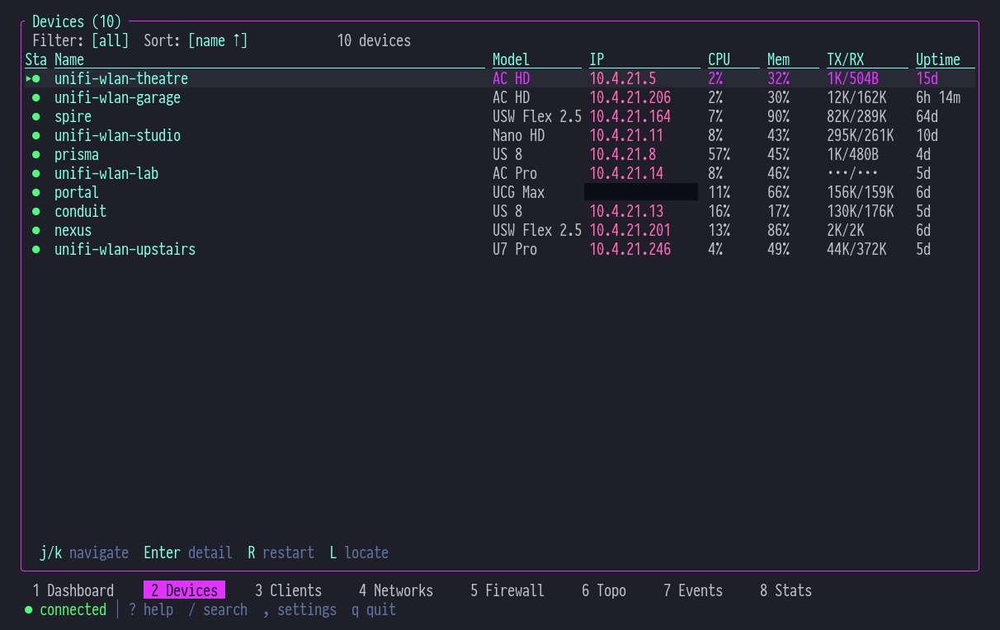
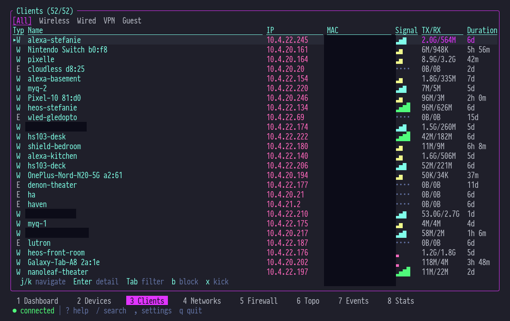

<h1 align="center">
  <br>
  🌐 unifly
  <br>
</h1>

<p align="center">
  <strong>Your UniFi Network, at Your Fingertips</strong><br>
  <sub>✦ CLI + TUI for UniFi Network Controllers ✦</sub>
</p>

<p align="center">
  
  
  
  
  
</p>

<p align="center">
  <a href="#-features">Features</a> •
  <a href="#-install">Install</a> •
  <a href="#-quick-start">Quick Start</a> •
  <a href="#-cli">CLI</a> •
  <a href="#-tui">TUI</a> •
  <a href="#-architecture">Architecture</a> •
  <a href="#-development">Development</a>
</p>

---

## 💜 What is unifly?

A complete command-line toolkit for managing Ubiquiti UniFi network controllers. Two binaries — one CLI for scripting and automation, one TUI for real-time monitoring — both powered by a shared async engine that speaks every UniFi API dialect.

> _Manage devices, monitor clients, inspect VLANs, stream events, and watch bandwidth charts — all without leaving your terminal._

The Integration API handles CRUD. The Legacy API fills the gaps with events, statistics, and device commands. WebSocket pushes real-time updates. **unifly** unifies all three into a single, coherent interface.

---

## ✦ Features

| Capability | What You Get |
| --- | --- |
| 🔮 **Dual API Engine** | Integration API (REST, API key) + Legacy API (session, cookie/CSRF) — automatic negotiation |
| ⚡ **Real-Time TUI** | btop-inspired dashboard with Braille traffic charts, CPU/MEM bars, live client counts |
| 🦋 **20+ Resource Types** | Devices, clients, networks, WiFi, firewall policies, zones, ACLs, DNS, VPN, hotspot vouchers, DPI... |
| 💎 **Flexible Output** | Table, JSON, compact JSON, YAML, and plain text — pipe-friendly for scripting |
| 🔒 **Secure Credentials** | OS keyring storage for API keys and passwords — nothing in plaintext |
| 🌐 **Multi-Profile** | Named profiles for multiple controllers — switch with a single flag |
| 🧠 **Smart Config** | Interactive wizard, environment variables, TOML config, CLI overrides — pick your style |
| 📡 **WebSocket Events** | Live event streaming with severity filtering and real-time push |
| 📊 **Historical Stats** | Gateway bandwidth, client counts, site stats — 1h to 30d time windows |

---

## ⚡ Install

### Homebrew

```bash
brew install hyperb1iss/tap/unifly
brew install hyperb1iss/tap/unifly-tui
```

### Shell Script (Linux / macOS)

```bash
curl --proto '=https' --tlsv1.2 -LsSf https://github.com/hyperb1iss/unifly/releases/latest/download/unifly-installer.sh | sh
curl --proto '=https' --tlsv1.2 -LsSf https://github.com/hyperb1iss/unifly/releases/latest/download/unifly-tui-installer.sh | sh
```

### PowerShell (Windows)

```powershell
powershell -ExecutionPolicy ByPass -c "irm https://github.com/hyperb1iss/unifly/releases/latest/download/unifly-installer.ps1 | iex"
powershell -ExecutionPolicy ByPass -c "irm https://github.com/hyperb1iss/unifly/releases/latest/download/unifly-tui-installer.ps1 | iex"
```

### From Source

```bash
cargo install --git https://github.com/hyperb1iss/unifly.git unifly
cargo install --git https://github.com/hyperb1iss/unifly.git unifly-tui
```

---

## 🔮 Quick Start

Run the interactive setup wizard:

```bash
unifly config init
```

The wizard walks you through controller URL, authentication method, and site selection. Credentials are stored in your OS keyring — never written to disk in plaintext.

Once configured:

```bash
unifly devices list          # All adopted devices
unifly clients list          # Connected clients
unifly networks list         # VLANs and subnets
unifly events stream         # Live event feed
```

```
 ID                                   | Name            | Model           | Status
--------------------------------------+-----------------+-----------------+--------
 a1b2c3d4-e5f6-7890-abcd-ef1234567890 | Office Gateway  | UDM-Pro         | ONLINE
 b2c3d4e5-f6a7-8901-bcde-f12345678901 | Living Room AP  | U6-LR           | ONLINE
 c3d4e5f6-a7b8-9012-cdef-123456789012 | Garage Switch   | USW-Lite-8-PoE  | ONLINE
```

---

## 🔐 Authentication

### API Key (recommended)

Generate a key on your controller under **Settings > Integrations**. Full CRUD access via the Integration API.

```bash
unifly config init                     # Select "API Key" during setup
unifly --api-key <KEY> devices list    # Or pass directly
```

### Username / Password

Legacy session-based auth with cookie and CSRF token handling. Required for events, statistics, and device commands not yet in the Integration API.

```bash
unifly config init                     # Select "Username/Password" during setup
```

### Hybrid Mode

Best of both worlds — API key for Integration API CRUD, username/password for Legacy API features. The wizard offers this when both are available.

### Environment Variables

| Variable | Description |
| --- | --- |
| `UNIFI_API_KEY` | Integration API key |
| `UNIFI_URL` | Controller URL |
| `UNIFI_PROFILE` | Profile name |
| `UNIFI_SITE` | Site name or UUID |
| `UNIFI_OUTPUT` | Default output format |
| `UNIFI_INSECURE` | Accept self-signed TLS certs |
| `UNIFI_TIMEOUT` | Request timeout (seconds) |

---

## 💻 CLI

### Commands

| Command | Alias | Description |
| --- | --- | --- |
| `devices` | `d` | Manage adopted and pending devices |
| `clients` | `cl` | Manage connected clients |
| `networks` | `n` | Manage networks and VLANs |
| `wifi` | `w` | Manage WiFi broadcasts (SSIDs) |
| `firewall` | `fw` | Manage firewall policies and zones |
| `acl` | | Manage ACL rules |
| `dns` | | Manage DNS policies (local records) |
| `traffic-lists` | | Manage traffic matching lists |
| `hotspot` | | Manage hotspot vouchers |
| `vpn` | | View VPN servers and tunnels |
| `sites` | | Manage sites |
| `events` | | View and stream events |
| `alarms` | | Manage alarms |
| `stats` | | Query statistics and reports |
| `system` | `sys` | System operations and info |
| `admin` | | Administrator management |
| `dpi` | | DPI reference data |
| `radius` | | View RADIUS profiles |
| `wans` | | View WAN interfaces |
| `countries` | | List available country codes |
| `config` | | Manage CLI configuration |
| `completions` | | Generate shell completions |

Most commands support `list`, `get`, `create`, `update`, and `delete` subcommands. Run `unifly <command> --help` for details.

### Global Flags

```
-p, --profile <NAME>     Controller profile to use
-c, --controller <URL>   Controller URL (overrides profile)
-s, --site <SITE>        Site name or UUID
-o, --output <FORMAT>    Output: table, json, json-compact, yaml, plain
-k, --insecure           Accept self-signed TLS certificates
-v, --verbose            Increase verbosity (-v, -vv, -vvv)
-q, --quiet              Suppress non-error output
-y, --yes                Skip confirmation prompts
    --timeout <SECS>     Request timeout (default: 30)
    --color <MODE>       Color: auto, always, never
```

### Shell Completions

```bash
# Bash
unifly completions bash > ~/.local/share/bash-completion/completions/unifly

# Zsh
unifly completions zsh > ~/.zfunc/_unifly

# Fish
unifly completions fish > ~/.config/fish/completions/unifly.fish
```

---

## 🖥️ TUI

The `unifly-tui` binary is a real-time terminal dashboard for monitoring your UniFi network.

```bash
unifly-tui                   # Launch with default profile
unifly-tui -p office         # Use a specific profile
unifly-tui -v                # Verbose logging
```

### Screens

Navigate with number keys `1`–`8` or `Tab`/`Shift+Tab`:

| Key | Screen | Description |
| --- | --- | --- |
| `1` | **Dashboard** | btop-style overview — WAN traffic chart, gateway info, system health, networks with IPv6, top clients, recent events |
| `2` | **Devices** | Adopted devices with model, firmware, IP, uptime, CPU/MEM, client counts |
| `3` | **Clients** | Connected clients — hostname, IP, MAC, VLAN, signal strength, traffic |
| `4` | **Networks** | VLAN topology — subnets, DHCP ranges, IPv6 config, IGMP settings |
| `5` | **Firewall** | Policies and zones with rule counts and traffic direction |
| `6` | **Topology** | Network topology tree view |
| `7` | **Events** | Live event stream with severity indicators |
| `8` | **Stats** | Historical charts — WAN bandwidth, client counts, DPI breakdown |

### Dashboard

The dashboard packs seven live panels into a single view:

<p align="center">
  
</p>

- **WAN Traffic** — Braille line chart with live TX/RX rates and peak tracking
- **Gateway** — WAN IP, DNS, latency, uptime, ISP name, IPv6 when available
- **System Health** — Subsystem status dots, CPU/MEM utilization bars, load averages
- **Networks** — VLANs sorted by ID with IPv6 prefix delegation and mode
- **Top Clients** — Proportional traffic bars with fractional block characters
- **Recent Events** — Compact two-per-line event display

### Devices & Clients

<p align="center">
  
</p>

<p align="center">
  
</p>

### Key Bindings

| Key | Action |
| --- | --- |
| `1`–`8` | Switch screens |
| `Tab` / `Shift+Tab` | Next / previous screen |
| `j` / `k` | Scroll down / up |
| `Enter` | Open detail view |
| `Esc` | Close detail / go back |
| `/` | Search / filter |
| `q` | Quit |

---

## 🏗️ Architecture

Five crates, clean dependency chain:

```
                    unifly (CLI binary)
                         │
                         ▼
  unifly-tui ───▶ unifi-core ───▶ unifi-api
  (TUI binary)   (business       (HTTP/WS
                   logic)          transport)
                     │
                     ▼
                unifi-config
                (profiles, keyring,
                 TOML config)
```

| Crate | Purpose |
| --- | --- |
| **unifi-api** | Async HTTP/WebSocket client — Integration API, Legacy API (with CSRF), WebSocket event stream |
| **unifi-core** | Controller lifecycle, DataStore (`DashMap` + `tokio::watch`), entity models, reactive streams |
| **unifi-config** | Profile management, keyring integration, TOML config, environment variable overlay |
| **unifly** | CLI binary — clap-based command routing, output formatting, shell completions |
| **unifly-tui** | TUI binary — ratatui screens, Braille charts, SilkCircuit theme, real-time data bridge |

### Data Flow

```
Controller URL ──▶ Integration API ──▶ REST (API key auth)
                   Legacy API ────────▶ REST (cookie + CSRF)
                   WebSocket ─────────▶ Push events

                         │
                         ▼
                    Controller
                   ┌──────────┐
                   │ DataStore │ ◀── DashMap + watch channels
                   │ Refresh   │ ◀── Background polling (30s)
                   │ Commands  │ ◀── Action channel (mpsc)
                   └──────────┘
                         │
              ┌──────────┼──────────┐
              ▼          ▼          ▼
           CLI out    TUI render  Event stream
```

The `Controller` wraps `Arc<ControllerInner>` for cheap cloning across async tasks. `EntityStream<T>` wraps `tokio::watch::Receiver` for reactive subscriptions — the TUI receives updates without polling.

---

## ⚙️ Configuration

Config lives at `~/.config/unifly/config.toml`:

```toml
default_profile = "home"

[defaults]
output = "table"
color = "auto"
insecure = false
timeout = 30

[profiles.home]
controller = "https://192.168.1.1"
site = "default"
auth_mode = "hybrid"
# API key + password stored in OS keyring

[profiles.office]
controller = "https://10.0.0.1"
site = "default"
auth_mode = "legacy"
username = "admin"
insecure = true
```

```bash
unifly config init             # Interactive setup
unifly config use office       # Switch active profile
unifly config profiles         # List profiles (* marks active)
unifly --profile home devices  # One-off override
```

---

## 🦋 Development

### Prerequisites

- Rust 1.86+ (edition 2024)
- A UniFi Network controller (Cloud Key, Dream Machine, or self-hosted)

### Build

```bash
git clone https://github.com/hyperb1iss/unifly.git
cd unifly
cargo build --workspace
```

### Test & Lint

```bash
cargo test --workspace
cargo clippy --workspace -- -D warnings
```

### Run

```bash
cargo run -p unifly -- devices list
cargo run -p unifly-tui
```

### Workspace Layout

```
crates/
  unifi-api/      # Async HTTP/WS client
  unifi-core/     # Business logic, Controller, DataStore
  unifi-config/   # Profiles, keyring, TOML config
  unifly/         # CLI binary (unifly)
  unifly-tui/     # TUI binary (unifly-tui)
```

### Lint Policy

Pedantic clippy with `unsafe_code = "forbid"`. See `Cargo.toml` workspace lints for the full configuration — it's opinionated and we like it that way.

---

## ⚖️ License

Apache-2.0 — See [LICENSE](LICENSE)

---

<p align="center">
  <a href="https://github.com/hyperb1iss/unifly">
    
  </a>
  &nbsp;&nbsp;
  <a href="https://ko-fi.com/hyperb1iss">
    
  </a>
</p>

<p align="center">
  <sub>
    If unifly keeps your network humming, give us a ⭐ or <a href="https://ko-fi.com/hyperb1iss">support the project</a>
    <br><br>
    ✦ Built with obsession by <a href="https://hyperbliss.tech"><strong>Hyperbliss Technologies</strong></a> ✦
  </sub>
</p>
