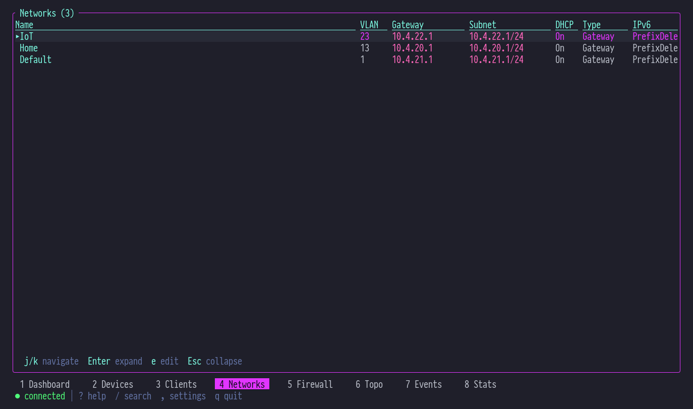
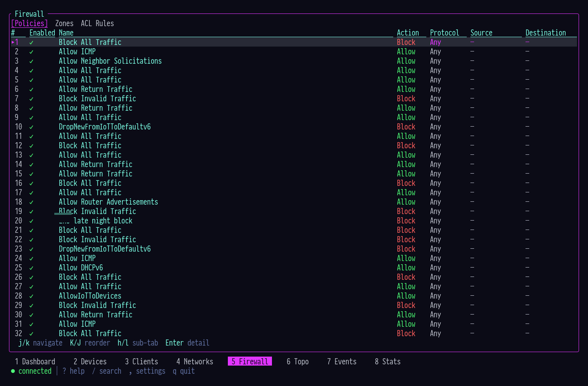
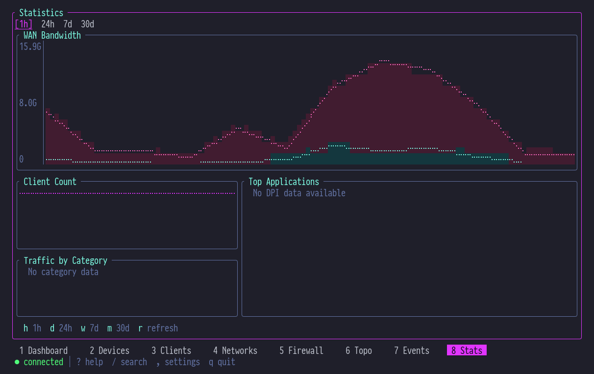

<h1 align="center">
  <br>
  🌐 unifly
  <br>
</h1>

<p align="center">
  <strong>Your UniFi Network, at Your Fingertips</strong><br>
  <sub>✦ CLI + TUI for UniFi Network Controllers ✦</sub>
</p>

<p align="center">
  
  
  
  
  
</p>

<p align="center">
  <a href="#-features">Features</a> •
  <a href="#-install">Install</a> •
  <a href="#-quick-start">Quick Start</a> •
  <a href="#-cli">CLI</a> •
  <a href="#-tui">TUI</a> •
  <a href="#-architecture">Architecture</a> •
  <a href="#-library">Library</a> •
  <a href="#-ai-agent-skill">AI Agent Skill</a> •
  <a href="#-development">Development</a>
</p>

---

## 💜 What is unifly?

A complete command-line toolkit for managing Ubiquiti UniFi network controllers. Two binaries — one CLI for scripting and automation, one TUI for real-time monitoring — both powered by a shared async engine that speaks every UniFi API dialect.

> _Manage devices, monitor clients, inspect VLANs, stream events, and watch bandwidth charts — all without leaving your terminal._

The Integration API handles CRUD. The Legacy API fills the gaps with events, statistics, and device commands. WebSocket pushes real-time updates. **unifly** unifies all three into a single, coherent interface.

---

## ✦ Features

| Capability | What You Get |
| --- | --- |
| 🔮 **Dual API Engine** | Integration API (REST, API key) + Legacy API (session, cookie/CSRF) — automatic negotiation with Hybrid mode |
| ⚡ **Real-Time TUI** | 8-screen dashboard with area-fill traffic charts, CPU/MEM gauges, live client counts, zoomable topology |
| 🦋 **22 Resource Types** | Devices, clients, networks, WiFi, firewall policies, zones, ACLs, DNS, VPN, hotspot vouchers, DPI, RADIUS... |
| 💎 **Flexible Output** | Table, JSON, compact JSON, YAML, and plain text — pipe-friendly for scripting |
| 🔒 **Secure Credentials** | OS keyring storage for API keys and passwords — nothing in plaintext |
| 🌐 **Multi-Profile** | Named profiles for multiple controllers — switch with a single flag |
| 🧠 **Smart Config** | Interactive wizard, environment variables, TOML config, CLI overrides — pick your style |
| 📡 **WebSocket Events** | Live event streaming with 10K rolling buffer, severity filtering, pause/scroll-back |
| 📊 **Historical Stats** | WAN bandwidth area fills, client counts, DPI app/category breakdown — 1h to 30d windows |
| 🎨 **SilkCircuit Theme** | Neon-on-dark color palette with semantic highlighting, ANSI fallback, responsive layouts |

---

## ⚡ Install

### Homebrew

```bash
brew install hyperb1iss/tap/unifly
```

Installs both `unifly` (CLI) and `unifly-tui` (TUI) in one shot.

### Shell Script (Linux / macOS)

```bash
curl --proto '=https' --tlsv1.2 -LsSf https://github.com/hyperb1iss/unifly/releases/latest/download/unifly-installer.sh | sh
curl --proto '=https' --tlsv1.2 -LsSf https://github.com/hyperb1iss/unifly/releases/latest/download/unifly-tui-installer.sh | sh
```

### PowerShell (Windows)

```powershell
powershell -ExecutionPolicy ByPass -c "irm https://github.com/hyperb1iss/unifly/releases/latest/download/unifly-installer.ps1 | iex"
powershell -ExecutionPolicy ByPass -c "irm https://github.com/hyperb1iss/unifly/releases/latest/download/unifly-tui-installer.ps1 | iex"
```

### From Source

```bash
cargo install --git https://github.com/hyperb1iss/unifly.git unifly
cargo install --git https://github.com/hyperb1iss/unifly.git unifly-tui
```

---

## 🔮 Quick Start

Run the interactive setup wizard:

```bash
unifly config init
```

The wizard walks you through controller URL, authentication method, and site selection. Credentials are stored in your OS keyring — never written to disk in plaintext.

Once configured:

```bash
unifly devices list          # All adopted devices
unifly clients list          # Connected clients
unifly networks list         # VLANs and subnets
unifly events stream         # Live event feed
```

```
 ID                                   | Name            | Model           | Status
--------------------------------------+-----------------+-----------------+--------
 a1b2c3d4-e5f6-7890-abcd-ef1234567890 | Office Gateway  | UDM-Pro         | ONLINE
 b2c3d4e5-f6a7-8901-bcde-f12345678901 | Living Room AP  | U6-LR           | ONLINE
 c3d4e5f6-a7b8-9012-cdef-123456789012 | Garage Switch   | USW-Lite-8-PoE  | ONLINE
```

---

## 🔐 Authentication

### API Key (recommended)

Generate a key on your controller under **Settings > Integrations**. Full CRUD access via the Integration API.

```bash
unifly config init                     # Select "API Key" during setup
unifly --api-key <KEY> devices list    # Or pass directly
```

### Username / Password

Legacy session-based auth with cookie and CSRF token handling. Required for events, statistics, and device commands not yet in the Integration API.

```bash
unifly config init                     # Select "Username/Password" during setup
```

### Hybrid Mode

Best of both worlds — API key for Integration API CRUD, username/password for Legacy API features. The wizard offers this when both are available.

### Environment Variables

| Variable | Description |
| --- | --- |
| `UNIFI_API_KEY` | Integration API key |
| `UNIFI_URL` | Controller URL |
| `UNIFI_PROFILE` | Profile name |
| `UNIFI_SITE` | Site name or UUID |
| `UNIFI_OUTPUT` | Default output format |
| `UNIFI_INSECURE` | Accept self-signed TLS certs |
| `UNIFI_TIMEOUT` | Request timeout (seconds) |

---

## 💻 CLI

### Commands

| Command | Alias | Description |
| --- | --- | --- |
| `acl` | | Manage ACL rules |
| `admin` | | Administrator management |
| `alarms` | | Manage alarms |
| `clients` | `cl` | Manage connected clients |
| `completions` | | Generate shell completions |
| `config` | | Manage CLI configuration |
| `countries` | | List available country codes |
| `devices` | `d` | Manage adopted and pending devices |
| `dns` | | Manage DNS policies (local records) |
| `dpi` | | DPI reference data |
| `events` | | View and stream events |
| `firewall` | `fw` | Manage firewall policies and zones |
| `hotspot` | | Manage hotspot vouchers |
| `networks` | `n` | Manage networks and VLANs |
| `radius` | | View RADIUS profiles |
| `sites` | | Manage sites |
| `stats` | | Query statistics and reports |
| `system` | `sys` | System operations and info |
| `traffic-lists` | | Manage traffic matching lists |
| `vpn` | | View VPN servers and tunnels |
| `wans` | | View WAN interfaces |
| `wifi` | `w` | Manage WiFi broadcasts (SSIDs) |

Most commands support `list`, `get`, `create`, `update`, and `delete` subcommands. Run `unifly <command> --help` for details.

### Global Flags

```
-p, --profile <NAME>     Controller profile to use
-c, --controller <URL>   Controller URL (overrides profile)
-s, --site <SITE>        Site name or UUID
-o, --output <FORMAT>    Output: table, json, json-compact, yaml, plain
-k, --insecure           Accept self-signed TLS certificates
-v, --verbose            Increase verbosity (-v, -vv, -vvv)
-q, --quiet              Suppress non-error output
-y, --yes                Skip confirmation prompts
    --timeout <SECS>     Request timeout (default: 30)
    --color <MODE>       Color: auto, always, never
```

### Shell Completions

```bash
# Bash
unifly completions bash > ~/.local/share/bash-completion/completions/unifly

# Zsh
unifly completions zsh > ~/.zfunc/_unifly

# Fish
unifly completions fish > ~/.config/fish/completions/unifly.fish
```

---

## 🖥️ TUI

The `unifly-tui` binary is a real-time terminal dashboard for monitoring and managing your UniFi network. Eight screens cover everything from live bandwidth charts to firewall policy management.

```bash
unifly-tui                   # Launch with default profile
unifly-tui -p office         # Use a specific profile
unifly-tui -k                # Accept self-signed TLS certs
unifly-tui -v                # Verbose logging
```

### Screens

Navigate with number keys `1`–`8` or `Tab`/`Shift+Tab`:

| Key | Screen | Description |
| --- | --- | --- |
| `1` | **Dashboard** | btop-style overview — area-fill WAN traffic chart, gateway info, connectivity health, CPU/MEM bars, networks with IPv6, WiFi AP experience, top clients, recent events |
| `2` | **Devices** | Adopted devices with model, IP, CPU/MEM, TX/RX, uptime — 5-tab detail panel (Overview, Performance, Radios, Clients, Ports) |
| `3` | **Clients** | Connected clients — hostname, IP, MAC, VLAN, signal bars, traffic — filterable by type (All/Wireless/Wired/VPN/Guest) |
| `4` | **Networks** | VLAN topology — subnets, DHCP, IPv6, gateway type — inline edit overlay for live config changes |
| `5` | **Firewall** | Policies, zones, and ACL rules across three sub-tabs — visual rule reordering |
| `6` | **Topology** | Zoomable network topology tree — gateway → switches → APs, color-coded by type and state |
| `7` | **Events** | Live event stream with 10K rolling buffer — pause, scroll back, severity color-coding |
| `8` | **Stats** | Historical charts — WAN bandwidth area fills, client counts, DPI app/category breakdown (1h/24h/7d/30d) |

### Dashboard

The dashboard packs eight live panels into a dense, information-rich overview:

<p align="center">
  
</p>

- **WAN Traffic** — Area-fill chart with Braille line overlay, live TX/RX rates, peak tracking
- **Gateway** — Model, firmware, WAN IP, IPv6, DNS, ISP, latency, uptime
- **Connectivity** — Subsystem status dots (WAN/WWW/WLAN/LAN/VPN), aggregate traffic bars
- **Capacity** — Color-coded CPU/MEM gauges, load averages, device/client fleet summary
- **Networks** — VLANs sorted by ID with IPv6 prefix delegation and SLAAC mode
- **WiFi / APs** — Client count, WiFi experience %, channel info per access point
- **Top Clients** — Proportional traffic bars with fractional block characters
- **Recent Events** — Two-column compact event display, color-coded by severity

### Devices & Clients

<p align="center">
  
</p>

<p align="center">
  
</p>

### Networks & Firewall

<p align="center">
  
</p>

<p align="center">
  
</p>

### Stats

Historical statistics with selectable time windows and dual-API data sourcing:

<p align="center">
  
</p>

- **WAN Bandwidth** — TX/RX area fills with Braille line overlay, auto-scaling axes
- **Client Count** — Braille line chart tracking connected clients over time
- **Top Applications** — DPI application breakdown with proportional bars (Integration API names, Legacy fallback)
- **Traffic by Category** — Percentage bars for streaming, gaming, social, etc.

### Key Bindings

#### Global

| Key | Action |
| --- | --- |
| `1`–`8` | Jump to screen |
| `Tab` / `Shift+Tab` | Next / previous screen |
| `j` / `k` / `↑` / `↓` | Navigate up / down |
| `g` / `G` | Jump to top / bottom |
| `Ctrl+d` / `Ctrl+u` | Page down / up |
| `Enter` | Select / expand detail |
| `Esc` | Close detail / go back |
| `/` | Search |
| `?` | Help overlay |
| `,` | Settings |
| `q` | Quit |

#### Screen-Specific

| Screen | Key | Action |
| --- | --- | --- |
| **Devices** | `R` | Restart device |
| **Devices** | `L` | Locate (flash LED) |
| **Devices** (detail) | `h` / `l` | Previous / next detail tab |
| **Clients** | `Tab` | Cycle filter (All → Wireless → Wired → VPN → Guest) |
| **Clients** | `b` / `B` | Block / unblock client |
| **Clients** | `x` | Kick client |
| **Networks** | `e` | Edit selected network |
| **Firewall** | `h` / `l` | Cycle sub-tabs (Policies / Zones / ACL Rules) |
| **Firewall** | `K` / `J` | Reorder policy up / down |
| **Topology** | `←` `→` `↑` `↓` | Pan canvas |
| **Topology** | `+` / `-` | Zoom in / out |
| **Topology** | `f` | Fit to view |
| **Events** | `Space` | Pause / resume live stream |
| **Stats** | `h` `d` `w` `m` | Period: 1h / 24h / 7d / 30d |
| **Stats** | `r` | Refresh |

---

## 🏗️ Architecture

Five crates, clean dependency chain:

```
                    unifly (CLI binary)
                         │
                         ▼
  unifly-tui ───▶ unifly-core ───▶ unifly-api
  (TUI binary)   (business       (HTTP/WS
                   logic)          transport)
                     │
                     ▼
                unifly-config
                (profiles, keyring,
                 TOML config)
```

| Crate | Purpose |
| --- | --- |
| **unifly-api** | Async HTTP/WebSocket client — Integration API, Legacy API (with CSRF), WebSocket event stream |
| **unifly-core** | Controller lifecycle, DataStore (`DashMap` + `tokio::watch`), entity models, reactive streams |
| **unifly-config** | Profile management, keyring integration, TOML config, environment variable overlay |
| **unifly** | CLI binary — clap-based command routing, output formatting, shell completions |
| **unifly-tui** | TUI binary — 8-screen ratatui dashboard, area-fill charts, SilkCircuit theme, real-time data bridge |

### Data Flow

```
Controller URL ──▶ Integration API ──▶ REST (API key auth)
                   Legacy API ────────▶ REST (cookie + CSRF)
                   WebSocket ─────────▶ Push events

                         │
                         ▼
                    Controller
                   ┌──────────┐
                   │ DataStore │ ◀── DashMap + watch channels
                   │ Refresh   │ ◀── Background polling (30s)
                   │ Commands  │ ◀── Action channel (mpsc)
                   └──────────┘
                         │
              ┌──────────┼──────────┐
              ▼          ▼          ▼
           CLI out    TUI render  Event stream
```

The `Controller` wraps `Arc<ControllerInner>` for cheap cloning across async tasks. `EntityStream<T>` wraps `tokio::watch::Receiver` for reactive subscriptions — the TUI receives updates without polling.

---

## ⚙️ Configuration

Config lives at `~/.config/unifly/config.toml`:

```toml
default_profile = "home"

[defaults]
output = "table"
color = "auto"
insecure = false
timeout = 30

[profiles.home]
controller = "https://192.168.1.1"
site = "default"
auth_mode = "hybrid"
# API key + password stored in OS keyring

[profiles.office]
controller = "https://10.0.0.1"
site = "default"
auth_mode = "legacy"
username = "admin"
insecure = true
```

```bash
unifly config init             # Interactive setup
unifly config use office       # Switch active profile
unifly config profiles         # List profiles (* marks active)
unifly --profile home devices  # One-off override
```

---

## 📦 Library

The core engine is available as two published crates on [crates.io](https://crates.io) — use them to build your own UniFi tools, integrations, or automations in Rust.

| Crate | Description |
| --- | --- |
| [](https://crates.io/crates/unifly-api) | Async HTTP/WebSocket transport — Integration API + Legacy API clients |
| [](https://crates.io/crates/unifly-core) | High-level Controller, reactive DataStore, domain models, command dispatch |

### Quick Start

**Low-level API access** — talk directly to the controller:

```rust
use unifly_api::{IntegrationClient, TransportConfig, TlsMode, ControllerPlatform};
use secrecy::SecretString;

let transport = TransportConfig::new(TlsMode::DangerAcceptInvalid);
let client = IntegrationClient::from_api_key(
    "https://192.168.1.1",
    &SecretString::from("your-api-key"),
    &transport,
    ControllerPlatform::UnifiOs,
)?;
let devices = client.list_devices("default").await?;
```

**High-level Controller** — reactive streams, automatic refresh, data merging:

```rust
use unifly_core::{Controller, ControllerConfig, AuthCredentials, TlsVerification};
use secrecy::SecretString;

let config = ControllerConfig {
    base_url: "https://192.168.1.1".parse()?,
    auth: AuthCredentials::ApiKey(SecretString::from("your-api-key")),
    tls: TlsVerification::DangerAcceptInvalid,
    ..Default::default()
};
let controller = Controller::new(config);
controller.connect().await?;

let devices = controller.devices().current();
println!("Found {} devices", devices.len());
```

Full API documentation on [docs.rs/unifly-api](https://docs.rs/unifly-api) and [docs.rs/unifly-core](https://docs.rs/unifly-core).

---

## 🤖 AI Agent Skill

unifly ships an AI agent skill that teaches coding assistants how to manage UniFi infrastructure. It includes a comprehensive CLI reference, automation workflows, and an autonomous network manager agent.

### Install via npx (Vercel Skills)

Works with Claude Code, Cursor, Copilot, Codex, Gemini, and more:

```bash
npx skills add hyperb1iss/unifly
```

Target a specific agent:

```bash
npx skills add hyperb1iss/unifly -a claude-code
npx skills add hyperb1iss/unifly -a cursor
npx skills add hyperb1iss/unifly -a copilot
```

### Install via Claude Code Plugin

```bash
/plugin marketplace add hyperb1iss/unifly
```

### Manual Installation

```bash
git clone https://github.com/hyperb1iss/unifly.git
ln -s $(pwd)/unifly ~/.claude/plugins/unifly
```

### What's Included

| Component | Description |
| --- | --- |
| **unifly skill** | Complete CLI reference, command patterns, output formats, automation tips |
| **Network Manager agent** | Autonomous agent for infrastructure provisioning, diagnostics, and security audits |
| **Reference docs** | Detailed command reference, UniFi networking concepts, workflow patterns |

The skill enables agents to create VLANs, manage firewall policies, provision WiFi, diagnose connectivity issues, generate guest vouchers, and more — all through the unifly CLI.

---

## 🦋 Development

### Prerequisites

- Rust 1.86+ (edition 2024)
- A UniFi Network controller (Cloud Key, Dream Machine, or self-hosted)

### Build

```bash
git clone https://github.com/hyperb1iss/unifly.git
cd unifly
cargo build --workspace
```

### Test & Lint

```bash
cargo test --workspace
cargo clippy --workspace -- -D warnings
```

### Run

```bash
cargo run -p unifly -- devices list
cargo run -p unifly-tui
```

### Workspace Layout

```
crates/
  unifly-api/      # Async HTTP/WS client
  unifly-core/     # Business logic, Controller, DataStore
  unifly-config/   # Profiles, keyring, TOML config
  unifly/          # CLI binary (unifly)
  unifly-tui/      # TUI binary (unifly-tui)
```

### Lint Policy

Pedantic clippy with `unsafe_code = "forbid"`. See `Cargo.toml` workspace lints for the full configuration — it's opinionated and we like it that way.

---

## ⚖️ License

Apache-2.0 — See [LICENSE](LICENSE)

---

<p align="center">
  <a href="https://github.com/hyperb1iss/unifly">
    
  </a>
  &nbsp;&nbsp;
  <a href="https://ko-fi.com/hyperb1iss">
    
  </a>
</p>

<p align="center">
  <sub>
    If unifly keeps your network humming, give us a ⭐ or <a href="https://ko-fi.com/hyperb1iss">support the project</a>
    <br><br>
    ✦ Built with obsession by <a href="https://hyperbliss.tech"><strong>Hyperbliss Technologies</strong></a> ✦
  </sub>
</p>
