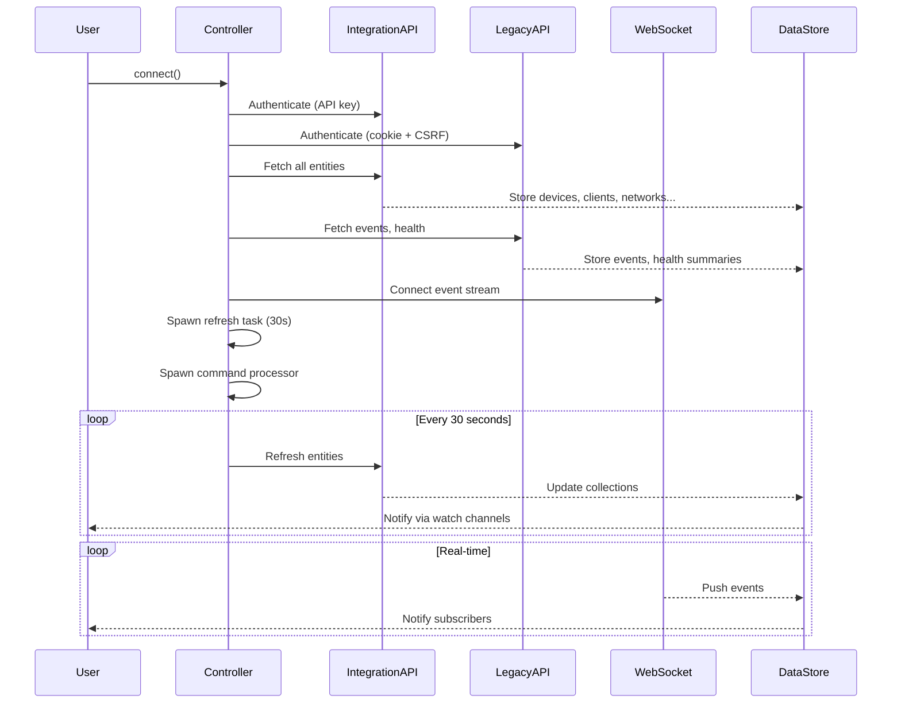
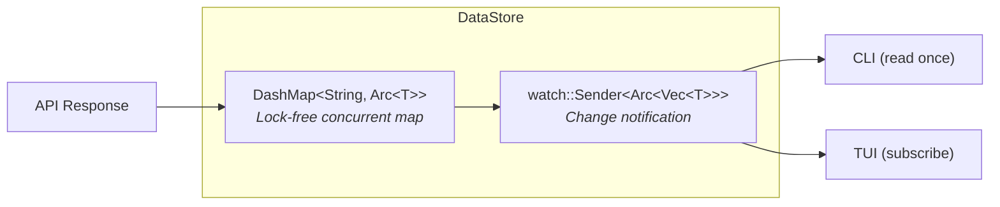

# Data Flow

## Connection Lifecycle



## Data Store Architecture

The `DataStore` uses a combination of `DashMap` and `tokio::watch` for lock-free reactive storage:



- **Writes** go through `DashMap::insert()` then `watch::Sender::send()`
- **CLI reads** call `current()` — snapshot of the latest data
- **TUI subscribes** via `changed()` — async notification on updates

## Entity ID Resolution

Entities can have different IDs depending on the API source:

| API | ID Format | Example |
|---|---|---|
| Integration | UUID v4 | `a1b2c3d4-e5f6-7890-abcd-ef1234567890` |
| Legacy | MAC address | `fc:ec:da:ab:cd:ef` |
| Synthetic | Prefixed string | `net:a1b2c3d4`, `wifi:e5f6a7b8` |

The `EntityId` enum handles this transparently:

```rust
enum EntityId {
    Uuid(Uuid),      // Integration API entities
    Legacy(String),  // Legacy API entities (MAC-based)
}
```

Non-MAC entities (networks, WiFi, firewall policies) use synthetic keys with a type prefix to avoid collisions in the shared `DashMap`.

## CLI vs TUI Data Patterns

| Pattern | CLI | TUI |
|---|---|---|
| **Connection** | `oneshot()` — no background tasks | `connect()` — full lifecycle |
| **Data access** | Single `current()` snapshot | `changed()` subscription loop |
| **Refresh** | None (fire-and-forget) | Automatic every 30 seconds |
| **Events** | Optional stream command | Always connected via WebSocket |
