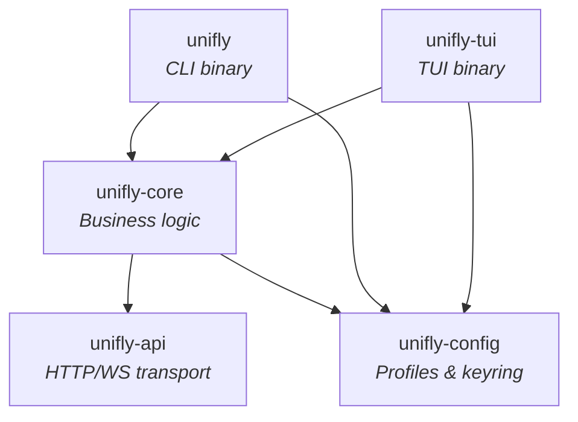

# Architecture

Unifly is a five-crate Rust workspace with a clean dependency chain. Each crate has a single responsibility, and dependencies flow in one direction.

## Crate Map

## Design Principles

### Thin Binaries, Fat Core

The CLI and TUI binaries are thin shells — they handle argument parsing and rendering, but all business logic lives in `unifi-core`. This means both binaries share identical controller lifecycle, data fetching, and entity management.

### Reactive Data Store

The `DataStore` uses `DashMap` for lock-free concurrent reads and `tokio::watch` channels for reactive updates. The TUI subscribes to entity streams and re-renders when data changes — no polling needed within the app.

### Dual API Transparency

`unifly-core` transparently routes requests to the correct API backend. Callers don't need to know whether a feature uses the Integration API or the Legacy API — the controller handles routing, authentication, and response normalization.

## Key Types

| Type | Purpose |
|---|---|
| `Controller` | Main entry point — wraps `Arc<ControllerInner>` for cheap cloning across async tasks |
| `DataStore` | Entity storage — `DashMap` + `watch` channels for lock-free reactive updates |
| `EntityStream<T>` | Reactive subscription — wraps `watch::Receiver` with `current()`/`changed()` API |
| `EntityId` | Dual-identity — `Uuid(Uuid)` or `Legacy(String)` for entities that exist in both APIs |
| `AuthCredentials` | Auth mode — `ApiKey`, `Credentials`, `Hybrid`, or `Cloud` variants |

## Next Steps

- [Crate Structure](/architecture/crates) — what each crate does
- [Data Flow](/architecture/data-flow) — how data moves through the system
- [API Surface](/architecture/api-surface) — Integration API vs Legacy API
